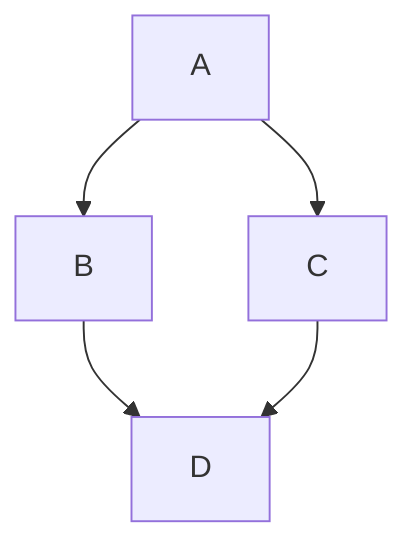

# Swanky Implementation Information

This document outlines implementation-specific information when contributing to Swanky.

[[_TOC_]]

## Language Choice

Swanky is written almost entirely in ([stable](#rust-version)) Rust.

Repository maintenance scripts, code generators, CI, or other tools which run at _compile-time_ are frequently written in Python (Rust is sometimes used instead).

For WebAssembly/webdev projects, some glue code is written in JavaScript. As of this writing (08/23) there isn't enough JavaScript code to warrant linters and formatters in CI for JS. If we end up doing much more web development in the future, we can set up formatters in CI and also switch to TypeScript.

In very rare cases, some Swanky code is written in C. Rust is preferred.

## Target Platform

Swanky primarily targets x86-64 Linux. As many Swanky developers use Macs, it should also run on both ARM and Intel Macs. Wasm32 is supported as a secondary target.

When writing Swanky code, it is _safe_ to assume that the target platform is little-endian and has the rust `std` library. It is not safe to assume that the target platform has 64-bit pointers.

Swanky should not depend on any dynamic libraries at runtime (all dependencies should be statically linked; this is standard for Rust code).

The Swanky build should not _require_ any tools other than the Rust compiler toolchain, `cargo`, and a C compiler/system linker.

In some cases, we may depend on external tools for code generation. If this is the case, the external tool should not be required for a default build of Swanky. For example, you should only need to have the flatbuffer code generator tool installed if you make changes to Swanky's flatbuffer files.

The goal of this requirement is to make sure that it is easy for new users to get started with Swanky. It's much easier to say "all you need is Rust," than it is to start requiring additional tools on top.

## Repository Organization

Swanky is developed in a monorepo.

### One Feature Per Crate

We prefer to have many smaller crates rather than a few big crates. This strategy can drastically improve compilation times (especially for release builds). It also makes it easier for us to more precisely track the dependencies of Swanky components.

For example, rather than having a single crate for all things oblivious transfer, we'd prefer to have a `swanky-ot-traits` crate for the core Oblivious Transfer traits, and then a `swanky-ot-*` crate for each OT protocol implementation.

The script `./swanky new-crate` makes it easy to create a new crate and register it the workspace's `Cargo.toml` file.

Use it like:

```terminal
# Create a crate named swanky-ot-kos
$ ./swanky new-crate swanky-ot-kos
```

### Cargo Features

[Cargo features](https://doc.rust-lang.org/cargo/reference/features.html) allow for conditional compilation of Rust code.

We should _avoid_ defining Cargo features whenever possible! Features are extremely hard to test, since we'd need to test all combinations of features.

#### How to avoid defining a Feature

##### Optionally Compile a Module

For code that would look like:

```rust
#[cfg(feature = "cool_module")]
pub mod cool_module;
```

Rather than defining a Cargo feature, it's preferable to create a [new crate](#one-feature-per-crate) with the optional functionality, instead.

##### Optionally Implement a Trait

For example, maybe you want to implement the [`num::Zero`](https://docs.rs/num/latest/num/trait.Zero.html) trait on a type you define, but you don't want to pull in the `num` dependency in all cases.

_With_ features (i.e. the **EVIL** way), the code would look like:

```rust
#[cfg(feature = "num")]
impl num::Zero for MyFunIntegerType { /* ... */ }
```

The better way is to unconditionally depend (i.e. without a Cargo feature) on the [`num_traits`](https://docs.rs/num-traits/latest/num_traits/identities/trait.Zero.html) crate. This crate is small since it _only_ contains the core traits of the `num` ecosystem, and so depending on it won't bloat compile times, while at the same time avoiding the definition of a new crate feature.

This technique isn't specific to the `num` ecosystem, either. Many Rust libraries provide an explicit `_traits`-style crate.

### Crate Layout

Crates must

* live in the `core/` or `edge/` directory. The directory structure must match the name of the crate (to make it easy to find the crate). For example `swanky-ot-kos` might live in `crates/ot-kos` or `crates/ot/kos`, but it shouldn't live in `crates/kos`.
* be named starting with the `swanky-` prefix. This makes it easy to determine which crates come from Swanky, and which crates are external dependencies.

## Documentation

Swanky APIs should be documented using [rustdoc](https://doc.rust-lang.org/rustdoc/index.html).

Libraries in Swanky _must_ (this is enforced in CI) include a `#![deny(missing_docs)]` directive to require that all public APIs are documented.

Documentation can be generated using [`cargo doc`](https://doc.rust-lang.org/cargo/commands/cargo-doc.html) so, for example `cargo doc --workspace --no-deps --open` will open Swanky documentation in your web browser.

Swanky enables several Markdown extensions: [LaTeX math with KaTeX](https://katex.org/) and diagrams with [Mermaid](http://mermaid.js.org/).

````markdown
Here's some inline math: $`x^2`$

And some block math:

```math
\frac{a}{b}
```

And a diagram!


````

## Code Formatting

In the Swanky repo, Rust code is automatically formatted with [rustfmt](https://github.com/rust-lang/rustfmt), and [black](https://github.com/psf/black) and [isort](https://pycqa.github.io/isort/) for Python code. CI will reject any code which isn't properly formatted.

We enforce code formatting practices (in CI) to try to keep git patches as meaningful as possible. It's easier to review a merge request if the only changes are changed intended by the author, and not changes to the tab width because of how the author configured their code editor.

You can autoformat Rust code with `cargo fmt` or format all code with `./swanky fmt`.

## Dependencies

### Version Pinning

We commit _exact_ versions of all dependencies into the Swanky repository. This ensures that _every_ user and developer of Swanky gets the identical dependencies, avoiding issues with dependency version mismatch.

CI will ensure that the checked-in version files (`Cargo.lock` and `rust-toolchain`) are a valid snapshot of our dependencies.

Because our focus is on cryptographic research, and not shipping a production library, we do not test Swanky against versions of dependencies or versions of Rust other than those that we've pinned.

### Rust Version

We pin a stable version of the Rust toolchain in the `rust-toolchain` file. We only use stable Rust features and do not build off of nightly. Our MSRV (Minimum Supported Rust Version) is the version that we have pinned. We try to update the pinned Rust version as new Rust versions are released.

## Cargo Workspace Inheritance

To ensure uniformity across Cargo metadata, `swanky` employs [Cargo's workspace inheritance functionality](https://betterprogramming.pub/workspace-inheritance-in-rust-65d0bb8f9424).
This functionality lets us set a common set of metadata (such as version, license, author) in the root `Cargo.toml` file, and have it automatically applied across all of our crates.
Similarly, we also use workspace inheritance to specify a single version of our dependencies in the root `Cargo.toml` file.

To use Cargo workspace inheritance, add to your `Cargo.toml` file:

```toml
[package]
authors.workspace = true
edition.workspace = true
license.workspace = true
publish.workspace = true
version.workspace = true
```

Use dependencies like:

```toml
num = { workspace = true, default-features = true }
vector2d.workspace = true
rand = { workspace = true, features = [ "log" ] }
```

CI will enforce the use of workspace inheritance.

## Tests

All code in Swanky _should_ be tested via Rust tests. Ideally, tests would test both valid input (the happy path) and invalid inputs.

When testing pure functions, use property-based-testing from [the `proptest` crate](https://proptest-rs.github.io/proptest/intro.html). This crate tests a function against random values, to see if its invariants hold. This is preferable (where applicable) to writing explicit unit test cases, since it is easier to maintain, and more directly encodes assumptions on test inputs.

When tests require the use of randomness, use the `proptest` crate to generate
any necessary randomness. This makes it easier to reproduce failing tests (since
the particular random values chosen are captured by the test infrastructure).
Note that because `proptest` runs many iterations of the test, it might make
sense to reduce the number of iterations for slow-running tests. This can be
done using
[`#)]`](https://proptest-rs.github.io/proptest/proptest/tutorial/config.html).

### Assets for Tests

Rather than reading files from tests (which will fail in CI due to a file not found error, due to our test caching setup), use `include_bytes!` or `include_str!` to instead copy the test asset that you want into the test binary at compile-time.

## Panicking

[`panic!`](https://doc.rust-lang.org/std/macro.panic.html)/[`unwrap`](https://doc.rust-lang.org/std/result/enum.Result.html#method.unwrap) (and friends) should only be used to report _internal_ errors (i.e. assertion failures) in the program. They should not be used as a general error handling technique (expect for tests and build scripts). If a program panics, that means that it has a bug.

The use of asserts can make a program more robust and easier to debug. It's much easier to debug a program with a failed assertion that yells "the problem is here," than it is to debug a program that reports no problems at all. Beyond that, assertions can be used to document the programmer's assumptions about the code in a way that's both human-readable and computer-checkable.

Rust provides two kinds of asserts [`assert!`](https://doc.rust-lang.org/std/macro.assert.html) and [`debug_assert!`](https://doc.rust-lang.org/std/macro.debug_assert.html). `assert!(cond)` will, for all build of the program, panic if `cond` is false. `debug_assert!(cond)` will only check (and panic if `cond`is false) for debug builds.

Rust also provides helpers [`assert_eq!`](https://doc.rust-lang.org/std/macro.assert_eq.html) (as well as not equal and `debug_` variants) which is roughly equivalent to `assert!(a == b, "{a:?} == {b:?})`. `assert_eq!` should be preferred over `assert!(a == b)`, because it prints out the inputs on panic.

We (except in extreme cases) avoid the use of [`std::panic::catch_unwind`](https://doc.rust-lang.org/std/panic/fn.catch_unwind.html) in Swanky, which makes it easier to reason about our code.

### Examples of Good Use of Panic

```rust
#[test]
fn my_test() {
    let (a, b) = UnixStream::pair().unwrap();
}

fn decode_le_ints(x: &[u8]) -> impl Iterator<Item = u32> + '_ {
    x.chunks_exact(4).map(|chunk| {
        // Because chunks_exact(4) only returns slices of size 4, this shouldn't panic.
        u32::from_le_bytes(<[u8; 4]>::try_from(chunk).unwrap())
    })
}

fn write_bytes_slow(my_buffer: &mut Buffer, data: &[u8]) -> eyre::Result<()> {
    my_buffer.force_flush()?;
    // Flushing should've emptied the buffer.
    debug_assert_eq!(my_buffer.write_buffer.len(), 0);
    my_buffer.copy_from(data);
}

// Because this function has documented that the haystack must be sorted,
// it becomes the responsiblity of this caller to satisfy this
// precondition. Possibly by calling .sort() on haystack before calling
// this function. Or maybe haystack is generated in such a way that the
// caller _knows_ that it will be already sorted.
/// # Panics
/// This function may panic if the input array isn't correctly sorted.
fn swanky_binary_search(haystack: &[u32], needle: u32) -> Option<usize> {
    debug_assert!(check_sorted(haystack));
    // ...
}
```

### Examples of Poor Use of Panic

```rust
fn main() -> eyre::Result<()> {
    let numbers: Vec<u32> =
        serde_json::from_str(
            &std::fs::read_to_string("test.json")
             .context("Opening 'test.json'")
        ).context("Decoding 'test.json'")?;
    // This is incorrect! swanky_binary_search (see above) requires that
    // numbers is in sorted order, and it may panic if that's not true.
    // In order to be correct, this program must either sort numbers, or
    // validate that numbers is in sorted order before this callsite.
    let out = swanky_binary_search(&numbers, 75);
}

fn main() {
    // If there's a DNS failure, or if example.com is down, or some other
    // problem _outside of the control of the program author_, this
    // program will panic.
    let tcp_stream = TcpStream::connect("example.com:80").unwrap();
    // ...
}
```

## Unsafe Code

Unsafe code should be avoided if possible., but sometimes it is necessary to use `unsafe` code, either for performance reasons, or maybe to interface with some [FFI](https://en.wikipedia.org/wiki/Foreign_function_interface).

For most operations, the Rust compiler will prove that, for example, the program won't segfault. However, there are some operations where the Rust compiler can't guarantee that all the requirements of an operation have been met, and that unsoundness could result if these requirement have been violated.

The `unsafe` keyword tells the Rust compiler that the programmer will take responsibility for ensuring these preconditions have been met. _Each_ `unsafe` block should document how it's meeting the preconditions of the operations contained within.

`unsafe` code should _almost never_ be mixed with business logic to let you reason about the correctness of `unsafe` code in isolation. Instead, prefer writing a safe wrapper which can contain the unsafe code wherever possible.

See [the sample implementation of `swap`](https://doc.rust-lang.org/std/ptr/fn.read.html#examples) as a good example of both of these principles.

## Constant-Time Operations

Swanky code that operates on private values should use constant-time operations to avoid [timing attacks](https://en.wikipedia.org/wiki/Timing_attack). We use the [subtle crate](https://docs.rs/subtle/latest/subtle/)
to execute constant-time operations.

## Allocations

Invoking the memory allocator to `malloc()` and `free()` memory takes a lot of computational resources. Reducing memory allocation can frequently produce large speedups in our benchmarks.

To that end, APIs should be written to avoid _requiring_ the use of the memory allocator. For example:

```rust
fn range(n: usize) -> Vec<usize> {
    let mut out = Vec::with_capacity(n);
    for i in 0..n {
        out.push(i);
    }
    out
}
```

This function _requires_ a new allocation each time it's invoked. It could be rewritten in any of the following ways to eliminate the memory allocation.

If the caller provides the destination buffer, its allocation can be re-used across calls.

```rust
fn range(n: usize, dst: &mut Vec<usize>) {
    dst.reserve(n);
    for i in 0..n {
        dst.push(i);
    }
}
fn range_use_example() {
    let mut buf = Vec::new();
    for i in 0..15 {
        // This sets buf.len() to 0, but it doesn't free the allocation, so it
        // can be re-used in the next iteration.
        buf.clear();
        range(i, &mut buf);
        for j in buf.iter() {
            println!("{j}");
        }
    }
}
```

Alternatively, `range` could return an `Iterator`, which doesn't require that its outputs be stored in a buffer at all. This approach lets the compiler interleave the execution of `range` with its caller, providing a performance boost in some cases (in some cases, using an explicit buffer is faster).

```rust
// impl Iterator doesn't allocate anything.
fn range(n: usize) -> impl Iterator<Item = usize> {
    0..n
}
```

## Clippy

All of our Rust code _must_ pass cargo clippy. You can check that your code conforms to our configuration with `cargo clippy`. (Some projects deviate from this configuration if some warnings are too noisy for their application, or not noisy enough.)

If you find that a clippy lint that we have enabled is not a good match for your project, you can disable it in your code. The lint should be disabled for as small a scope as possible (e.g. disable the lint for a single function rather than a whole crate), and the reason for disabling the lint should be documented in a comment.

## Retry-Safe Code

Most protocols, unless it's explicitly designed to be retry-safe (which tends to be rare in our
cryptographic use-cases), should take `self` and return `Self` on success, rather than taking
`&mut self` as an argument.

If `Self` is returned, then it should be the last element of the resulting tuple.

* **Good**
  * `fn my_protocol_function(self, x: u128) -> Result<(u128, Self)>`
  * `fn my_protocol_function(self, x: u128) -> Result<Self>`
* **Bad**
  * `fn my_protocol_function(self, x: u128) -> Result<(Self, u128)>` (`Self` should be the last tuple element!)
  * `fn my_protocol_function(&mut self, x: u128)`

### Rationale

Consider the following code:

```rust
struct MyOneTimePad {
    key: Option<u128>,
}
impl MyOneTimePad {
    fn encrypt_and_send(&mut self, c: &mut Channel, msg: u128) -> Result<()> {
        let key = self.key.expect("don't re-use a one-time-pad!");
        c.write(key ^ msg)?;
        self.key = None;
        Ok(())
    }
}
```

This code is secure only so long as only one `key ^ msg` is ever sent to the other party (`key`
ought to be zeroed before it can be reused). The problem is that this code has a subtle bug: what
if there's a temporary network failure, and the caller retries.

```rust
let otp: MyOneTimePad;
loop {
    let msg: u128 = rand::random();
    match pad.encrypt_and_send(c) {
        Ok(()) => return Ok(()),
        Err(e) if e.kind() == ErrorKind::NetworkError => {
            // Ignore it! Try again!
        }
        Err(e) => return Err(e),
    }
}
```

Because `encrypt_and_send()` zeroes out the key _after_ a _successful_ write, subsequent
invocations of this function can leak the key. While this error might be easy to catch in this
simple example, these errors aren't always easy to catch.

To avoid this sort of error, unless you want your API to support being re-invoked in the event of
an error, it's preferable for APIs to _consume and return_ `self` on success. Like this:

```rust
impl MyOneTimePad {
    fn encrypt_and_send(self, c: &mut Channel, msg: u128) -> Result<Self> { /* ... */ }
}
```

Now, the Rust type-system will prevent `MyOneTimePad` from being re-used in the event of an error,
because each operation only returns `Self` after a _successful_ invocation.
