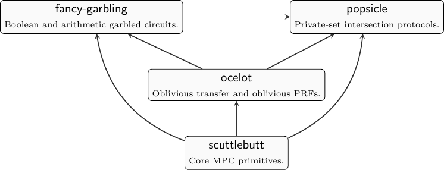

# **swanky**: A suite of rust libraries for secure multi-party computation

**swanky** provides a suite of rust libraries for doing secure multi-party
computation (MPC).

* **fancy-garbling**: Boolean and arithmetic garbled circuits.
  * **twopac**: Two-party garbled-circuit-based secure computation.
* **ocelot**: Oblivious transfer and oblivious PRFs.
* **popsicle**: Private-set intersection.
* **scuttlebutt**: Core MPC-related primitives used by various **swanky**
  libraries.

# A Note on Security

**swanky** is currently considered **prototype** software. Do not deploy it in
production, or trust it with sensitive data.

# License

MIT License

# Authors

- Brent Carmer <bcarmer@galois.com>
- Alex J. Malozemoff <amaloz@galois.com>
- Marc Rosen <marc@galois.com>

# Acknowledgments

This material is based upon work supported by the ARO and DARPA under Contract
No. W911NF-15-C-0227 and by DARPA and SSC Pacific under Contract No.
N66001-15-C-4070.

Any opinions, findings and conclusions or recommendations expressed in this
material are those of the author(s) and do not necessarily reflect the views of
the ARO, SSC Pacific, and DARPA.

Copyright © 2019 Galois, Inc.

# INTERSTELLAR WIP

- build: `cargo test --features=serde1,unix_channel,track_channel,sync_channel,curve25519,rand_aes,nightly,std,hash_aes,parser`
  - FAIL: good amount of work done but still not working
- `fancy-garling` OK? `cargo test -p fancy-garbling --features=serde1,nightly,std,parser`
  - compiles OK but some tests FAIL